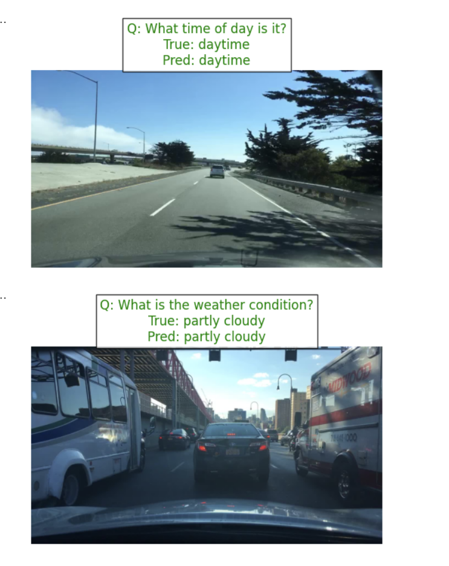
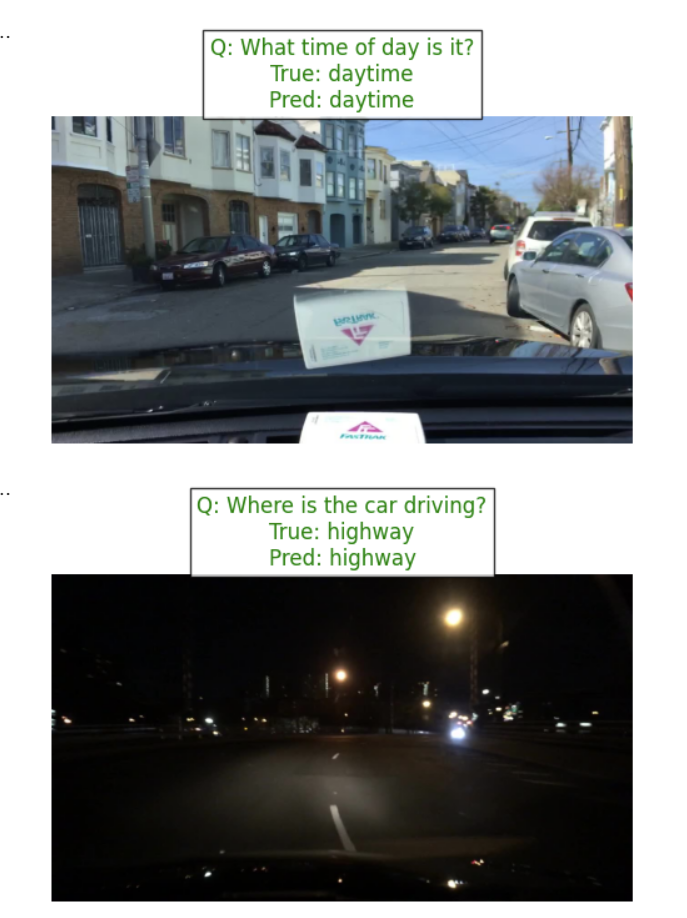

# Fine-Tuning PaliGemma for Autonomous Driving VQA

This project demonstrates how to fine-tune Google's **PaliGemma-3B** Vision-Language Model (VLM) for Visual Question Answering (VQA) tasks in the context of autonomous driving.

## Project Goal
The goal is to adapt a pre-trained VLM to understand and answer questions about driving scenes, such as weather conditions, time of day, and scene types, using a subset of the **BDD100K** (Berkeley DeepDrive) dataset.

## Dataset
- **Source**: BDD100K (Berkeley DeepDrive)
- **Subset**: A randomly sampled subset of 200 images from the training set.
- **Annotations**: Converted from BDD100K format to VQA format (Image + Question -> Answer).

## Methodology
1.  **Data Processing**: 
    - `process_data.py`: Extracts a 200-image subset from the BDD100K archive, copying images and filtering annotations.
    - `verify_data.py`: Verifies the integrity of the created subset (image counts, label matching).
2.  **Model**: `google/paligemma-3b-mix-224`
    - A multimodal model combining SigLIP (Vision) and Gemma (Language).
3.  **Optimization**:
    - **Quantization**: 4-bit quantization using `bitsandbytes` for memory efficiency.
    - **Fine-Tuning**: LoRA (Low-Rank Adaptation) using `peft` for efficient training.

## File Structure
- `VLM_AV_NLP.ipynb`: Main Jupyter Notebook for the fine-tuning workflow (Setup, Data Prep, Training, Inference).
- `process_data.py`: Python script to create the data subset.
- `verify_data.py`: Python script to validate the data subset.
- `bdd_subset/`: Directory containing the processed subset (Images + `labels.json`).
- `bdd_vqa_dataset/`: Saved Hugging Face dataset ready for training.

## Installation & Requirements
The project requires Python and the following libraries (as seen in the notebook):

```bash
pip install -U bitsandbytes accelerate peft transformers datasets
```

## Usage

### 1. Prepare Data
Run the processing script to create the subset:
```bash
python process_data.py
```

Verify the data:
```bash
python verify_data.py
```

### 2. Run the Notebook
Open `VLM_AV_NLP.ipynb` in Google Colab or a local Jupyter environment with GPU support. Follow the steps to:
1.  Install dependencies.
2.  Load and visualize the dataset.
3.  Load the PaliGemma model.
4.  Fine-tune the model.
5.  Run inference to test the model's understanding of driving scenes.

## Inference Results
Here are examples of the model's performance after fine-tuning:



